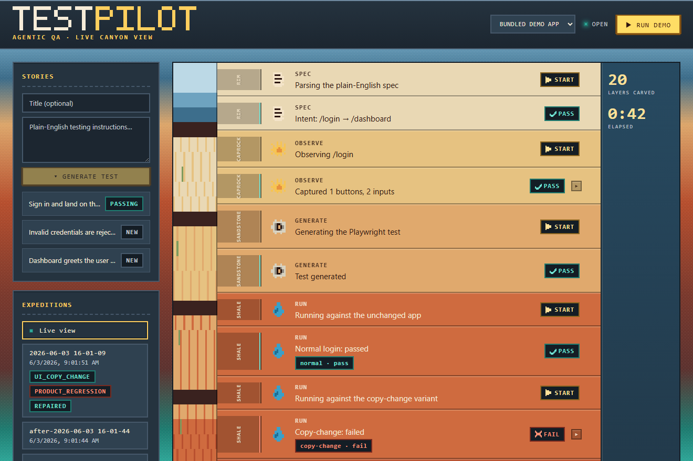

# testpilot

**Turn plain-English QA instructions into Playwright tests — then automatically diagnose and repair failures without weakening what the test was meant to check.**

[](https://github.com/LupeHiguera/testpilot/actions/workflows/ci.yml)

testpilot is an agentic QA tool. You describe a flow in everyday language ("go to
`/login`, sign in, and check the dashboard shows the user's name"); it observes the
running app, generates a Playwright test, runs it, and — when it fails — figures out
**why**. The key idea is restraint: when the UI merely *drifted* (a button's label
changed, a selector moved), it proposes a safe repair; when the *product* actually
broke (login no longer reaches the dashboard), it **refuses to touch the test** and
flags it for a human. A passing test suite stays meaningful instead of being quietly
rubber-stamped green.



---

## What it does

- **Generate** Playwright tests from natural-language stories.
- **Run** them against a live app and collect rich failure artifacts (error, screenshot, DOM, console, network).
- **Diagnose** failures into one of eight categories — distinguishing safe UI drift from real product regressions.
- **Repair** only safe drift, preserving the original assertions and intent; never weakening a test to make it pass.
- **Review** every change behind a human-approval gate (a local PR bundle, or a one-command GitHub PR with before/after screenshots).
- **Document** connected projects with living docs that are backed by — and kept honest by — the tests themselves.
- **Connect** real projects and ingest stories from manual upload, **GitHub**, or **Jira** (via MCP).
- **Watch** it all happen live in a Grand Canyon pixel-art dashboard.

Two model backends: a deterministic **mock** mode (default — reproducible, no API key) and an **OpenAI** mode for real generation, repair, and vision-assisted diagnosis.

---

## How it works

Every run flows through the same pipeline:

```
spec ─▶ observe ─▶ generate ─▶ run ─▶ diagnose ─▶ repair ─▶ report
 │         │           │         │        │           │         │
 NL     DOM +        Playwright  pass/   8-category  safe-only  markdown +
 story  screenshot   test        fail    + vision    repair     PR bundle
```

1. **Parse** the story into a structured test intent.
2. **Observe** the page (URL, DOM, accessibility info, screenshot, console, network).
3. **Generate** a Playwright test grounded in the observed page.
4. **Run** it; on failure, capture artifacts.
5. **Diagnose** the failure category.
6. **Repair** — only if the failure is safe drift the guardrails allow.
7. **Report** the decision (and assemble a PR if a repair was applied).

### The safety model

This is the heart of testpilot. A repair is only ever applied when **every** guard agrees:

- **Failure classifier** labels the failure as one of:
  `SELECTOR_DRIFT`, `UI_COPY_CHANGE`, `TIMING_OR_FLAKE` (repairable) vs.
  `PRODUCT_REGRESSION`, `APP_UNAVAILABLE`, `NETWORK_OR_API_FAILURE`,
  `AUTH_OR_TEST_DATA_FAILURE`, `UNKNOWN` (not repairable — needs a human).
- **Vision can veto, never authorize.** With `--vision`, a model reads the failure
  screenshot, but its verdict is merged so it can only make the diagnosis *more*
  cautious — it can downgrade a repair to "needs review," never upgrade a regression
  into an auto-repair.
- **Generated-test guard** refuses to write a test that drops the spec's route or
  expected outcome, or that contains `.only`/`.skip`/`TODO`.
- **Repair guard** refuses to remove assertions, change the expected business outcome,
  or edit anything outside the generated-test directory.
- **Human approval** — repairs are surfaced as a reviewable PR bundle or GitHub PR, never silently merged.

---

## Quick start

Requires Node 20+.

```bash
npm install
npm run playwright:install      # one-time: install Chromium

npm run testpilot -- demo --mode mock
```

The demo spins up a bundled login app and runs three scenarios end-to-end:

| Scenario | What happens |
|---|---|
| **Normal** | Generated test passes against the unchanged app. |
| **Copy change** ("Sign in" → "Log in") | Diagnosed `UI_COPY_CHANGE`; a safe repair is applied and the test passes again. |
| **Regression** (login no longer reaches `/dashboard`) | Diagnosed `PRODUCT_REGRESSION`; the repair is **refused** and a human is asked to review. |

Each run writes a markdown report and artifacts under `runs/<run>/`.

### Focused commands

```bash
npm run testpilot -- generate examples/login-spec.md --base-url http://127.0.0.1:3000
npm run testpilot -- run tests/generated/login.spec.ts --base-url http://127.0.0.1:3000
npm run testpilot -- diagnose runs/<run>/run-result.json examples/login-spec.md --vision
npm run testpilot -- repair tests/generated/login.spec.ts runs/<run>/run-result.json examples/login-spec.md
```

---

## The live dashboard

A Grand Canyon themed dashboard streams a run stage-by-stage: each pipeline stage
forms a "canyon stratum" that you can expand to its evidence (screenshot, diagnosis
and reasoning, diff, verdict) as events arrive over Server-Sent Events.

```bash
npm run ui:build      # build the dashboard (ui/ -> ui/dist)
npm run serve         # open http://127.0.0.1:4000, then press "Run demo" or upload a story
```

Toggle the topbar to **Docs** to browse the selected project's living documentation
(each flow's instructions, derived steps, and test-backed status) and write it into
the repo.

The server (`src/server`) exposes `GET /events` (SSE), `GET /api/runs`,
`GET /artifacts/*`, `GET /api/projects`, `GET /api/stories`, `GET /api/docs`, and
`POST` endpoints to trigger runs, stories, and docs. For UI development,
`npm run ui:dev` runs the Vite app with a dev proxy to the server.

---

## Connecting real projects

Beyond the bundled demo, register your own projects and feed them stories from several
sources. Generated tests and docs are written **into the connected repo**.

```bash
# Register a project (its base URL, where tests/docs go in its repo)
npm run testpilot -- project add acme --name "Acme web" --repo /path/to/acme \
  --base-url http://127.0.0.1:5173 --tests-dir tests/e2e

# Upload a story (or use the dashboard's Stories panel)
npm run testpilot -- spec add acme ./story.md

# Pull stories from GitHub issues (testpilot acts as an MCP client to the GitHub MCP server)
npm run testpilot -- spec pull acme --owner acme --repo web --label needs-test --generate

# Pull from Jira via a configured Jira MCP server
npm run testpilot -- spec pull-jira acme --jql "labels = needs-test"

# Generate living documentation backed by the tests
npm run testpilot -- docs acme
```

**Story ingestion** uses real MCP connectors — testpilot is the MCP *client*
(`src/mcp/client.ts`) and the GitHub/Jira MCP server launch is configurable per
project. GitHub auth comes from `GITHUB_TOKEN` or `gh auth token`.

**Living documentation** writes one markdown page per flow — the plain-English
instructions, the derived steps, and a status backed by the flow's test. Because each
doc is tied to a test, a failing status flags documentation that no longer matches the
product. The project registry lives in a gitignored `.testpilot/`.

---

## Modes

| Mode | Use | Notes |
|---|---|---|
| `--mode mock` (default) | Local dev, CI, demos | Deterministic; no API key; reproducible. |
| `--mode openai` | Real generation/repair/vision | Set `OPENAI_API_KEY`; falls back to mock behavior if a call fails. |

```bash
export OPENAI_API_KEY="sk-..."        # or: setx OPENAI_API_KEY "..." on Windows
npm run testpilot -- demo --mode openai
```

`--vision` (on `diagnose`/`repair`) adds a screenshot read to the diagnosis under the
veto-only safety invariant above. In mock mode the vision step is deterministic so CI
stays reproducible.

---

## CLI reference

| Command | Description |
|---|---|
| `demo` | Run the bundled three-scenario demo end-to-end. |
| `generate <spec> --base-url <url>` | Generate a test from a story. |
| `run <test> --base-url <url> [--variant v]` | Run a test and collect artifacts. |
| `diagnose <run-result> <spec> [--vision]` | Classify a failure. |
| `repair <test> <run-result> <spec> [--open-pr] [--vision]` | Propose & apply a safe repair; bundle or open a PR. |
| `serve [--port 4000]` | Start the live dashboard server. |
| `project add\|list` | Register / list connected projects. |
| `spec add <project> <file>` | Upload a story and run it. |
| `spec pull <project> --owner --repo [--label] [--generate]` | Pull GitHub issues as stories. |
| `spec pull-jira <project> [--jql]` | Pull Jira issues as stories. |
| `docs <project>` | Generate living documentation. |

---

## Project structure

```
src/
  spec/         parse a story into a structured intent
  browser/      observe the page + collect failure artifacts (Playwright)
  generator/    model clients (mock / openai) + test generation + guardrail
  runner/       run a Playwright test
  diagnosis/    heuristic classifier + vision merge
  repair/       propose / validate / apply safe repairs
  reporting/    markdown + JSON reports
  pr/           reviewable PR bundle + optional GitHub PR
  pipeline/     demo + story pipelines, demo-app lifecycle
  events/       process-local event bus (powers the live view)
  server/       SSE + REST server for the dashboard
  projects/     connected-project registry
  stories/      story store
  connectors/   GitHub / Jira MCP connectors
  mcp/          reusable MCP client
  docs/         living-documentation generator
ui/             the live dashboard (Vite + React)
tools/grader-mcp/  grader MCP server used to hold the dashboard to a rubric
demo/           the bundled demo app under test
```

---

## Development

```bash
npm run validate       # typecheck + unit tests
npm run validate:demo  # the above, then the full mock demo
npm run build          # typecheck only
npm run test           # unit tests
```

CI (`.github/workflows/ci.yml`) runs typecheck, unit tests, the dashboard build, and
the end-to-end mock demo on every push and PR.

### How the dashboard was built

The dashboard was developed with a two-agent loop kept honest by an MCP grader: a
**coder** agent implements the UI; a **grader** agent scores it against a fixed
7-criterion rubric using a real MCP server (`tools/grader-mcp/`) that captures
multi-viewport screenshots, runs axe-core accessibility checks, and records grades.
The rubric explicitly penalizes the generic "AI-generated dashboard" look, and a
revision only passes when every criterion clears the bar.

---

## Status & limitations

- **Arbitrary-app test generation is best-effort.** The login demo is curated; real
  apps are harder. Generation is a starting point, always behind the human-approval gate.
- **Repairs auto-apply only within the generated-test directory** (a deliberate safety
  boundary). Writing repairs into arbitrary external repos is intentionally gated.
- **Jira ingestion is code-complete but requires your Jira + Atlassian MCP server** to
  run live; the GitHub connector is verified end-to-end.

---

## License

MIT — see [LICENSE](./LICENSE).
